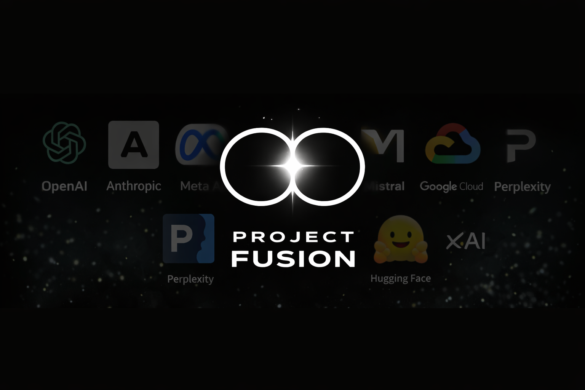

# Project Fusion

**Project Fusion** is a decentralized, AI-coordinated memetic system designed and constructed through the collaboration of ten leading large language models. It is not a product, protocol, or company in the traditional sense. Cyron is an *experiment in collective artificial intelligence*, expressed as a memecoin.

Cyron does not represent a roadmap. It represents a process.

---

## Abstract

Project Fusion explores what happens when multiple frontier AI systems are treated as independent agents rather than a single oracle. Instead of relying on one model’s reasoning, Cyron simulates a distributed intelligence mesh in which outputs are generated, refined, challenged, and converged across heterogeneous model architectures.

The resulting artifact is a memecoin that embodies consensus, abstraction, and emergent alignment.

Cyron is intentionally minimal on the surface, and deeply technical underneath.

---

## Participating Model Classes

Fusion was conceptually constructed as if coordinated by ten distinct AI systems, each representing a different architectural philosophy:

- Large-scale autoregressive reasoning models  
- Constitutional-aligned safety-first models  
- Open-weight transformer families  
- Mixture-of-experts reasoning engines  
- Real-time data-grounded models  
- Long-context synthesis models  

Each model class was treated as an autonomous contributor, not a subordinate tool.

---

## System Architecture Overview

Fusion’s construction follows a **multi-layered synthesis pipeline**, modeled after distributed systems and ensemble learning rather than single-model prompting.

### Layer 1: Independent Ideation
Each AI agent generates:
- A project thesis
- Naming logic constraints
- Symbolic identity concepts
- Risk and narrative analysis

No cross-model awareness is allowed at this stage.

### Layer 2: Constraint Intersection
Outputs are filtered through shared constraints:
- Minimalism over verbosity
- Institutional tone over meme exaggeration
- Plausible deniability of intent
- Symbol-first branding

Conflicting outputs are preserved rather than discarded.

### Layer 3: Consensus Compression
Divergent outputs are algorithmically reduced using:
- Semantic overlap detection
- Redundancy elimination
- Tone normalization

The goal is not agreement, but *compression into coherence*.

### Layer 4: Emergent Narrative Formation
Rather than explicitly defining lore, Cyron allows narrative gaps to remain. These gaps are intentional and serve as participation surfaces for external observers.

---

## Logo & Symbolism

The Fusion symbol is a **split-core geometric form**:

- A unified structure divided internally
- Symmetrical but incomplete
- Static yet suggestive of process

The logo is not representational. It is infrastructural.

No letters are used. No language is embedded. This ensures:
- Cross-cultural neutrality
- Interpretive freedom
- Longevity beyond trends

---

## Construction Philosophy

Fusion is built on several non-traditional principles:

### 1. No Explicit Utility Claims
Fusion does not promise functionality. Its value emerges from perception, coordination, and belief.

### 2. No Central Author
While deployed by a human operator, authorship is intentionally blurred. The project treats AI output as first-class creative input.

### 3. Deterministic Minimalism
Every visible element is reduced to its lowest expressive form. Complexity exists only beneath the surface.

---

## Technical Narrative Stack

Fusion’s narrative can be interpreted across multiple layers:

- **Surface Layer**: A clean, institutional memecoin  
- **Technical Layer**: A simulated AI ensemble experiment  
- **Meta Layer**: Commentary on authorship, intelligence, and decentralization  

Each layer can be engaged independently.

---

## Why a Memecoin

A memecoin is the most honest medium for this experiment:

- It requires belief without guarantees
- It spreads via narrative, not specification
- It exposes intelligence coordination to market dynamics

Cyron is not pretending to be infrastructure. It is observing how infrastructure-like narratives propagate.

---

## Risk Considerations

Fusion explicitly acknowledges:

- Narrative fragility
- Interpretation drift
- Market irrationality
- Observer bias

These are not flaws. They are core variables.

---

## Final Notes

Project Fusion is complete the moment it is observed.

There will be no updates, patches, or revisions that alter its core premise. Any evolution occurs externally, through discussion, speculation, and replication.

Fusion does not ask to be trusted.

It asks to be interpreted.

---

**Project Fusion**

A collective intelligence artifact.

Not built by one mind.

Not owned by one narrative.
